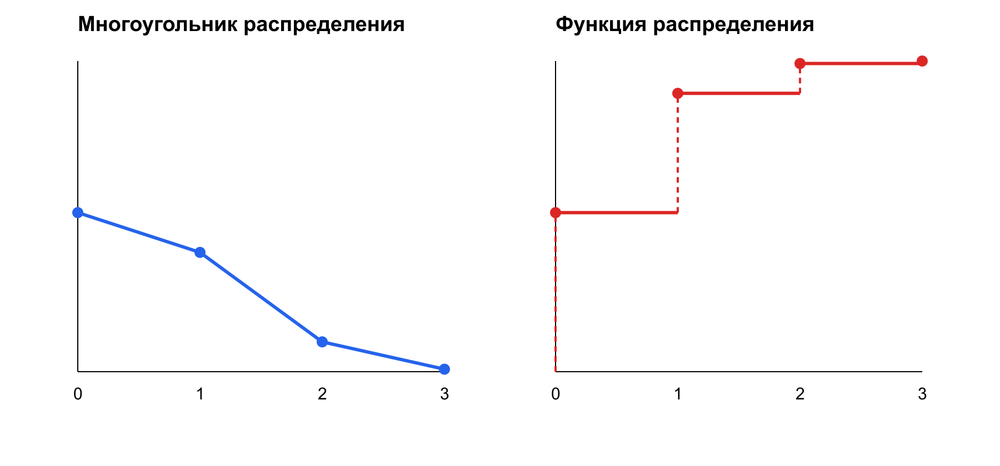

# Лекция № 5. Дискретные случайные величины и законы распределения

> Курс: «Теория вероятностей»  
> Продолжительность: 2 академических часа (90 минут)  
> Формат: сценарий лектора с формулами, графическими интерпретациями, задачами и Python-проверкой

## 1. Место лекции в курсе

До сих пор мы главным образом спрашивали, произошло ли событие. Но результат эксперимента часто выражается числом: сколько заявок поступило, сколько устройств отказало, сколько раз классификатор ошибся. Сегодня превратим результат случайного эксперимента в числовой объект — случайную величину — и перейдём от отдельных событий к целому распределению.

Начнём с результата предыдущей лекции. Для трёх независимых кустов, каждый из которых поражён фитофторой с вероятностью $0{,}2$, были получены четыре вероятности:

| Число поражённых кустов $k$ | 0 | 1 | 2 | 3 |
|---:|---:|---:|---:|---:|
| $P(X=k)$ | 0,512 | 0,384 | 0,096 | 0,008 |

В лекции № 4 это были четыре ответа на вопросы о числе успехов. Теперь прочитаем всю строку сразу: она задаёт **распределение числа поражённых кустов**. Главный вопрос лекции: как перейти от случайного эксперимента к такой строке, затем к графику, функции распределения и вероятности нужного события?

### Результаты обучения

После лекции студент должен уметь:

- определять случайную величину как функцию исхода;
- различать дискретные и непрерывные случайные величины;
- находить множество возможных значений дискретной величины;
- составлять и проверять ряд распределения;
- строить многоугольник и функцию распределения;
- извлекать вероятности из функции распределения;
- распознавать биномиальное и пуассоновское распределения;
- объяснять распределение в прикладном контексте.

### Входные знания

Нужны пространство исходов, события, вероятность, условная вероятность, сочетания, схема Бернулли и формула Пуассона.

### Ориентировочный тайминг

| Время | Содержание |
|---:|---|
| 0–7 мин | Переход от схемы Бернулли к распределению числа успехов |
| 7–20 мин | Случайная величина; дискретные и непрерывные величины |
| 20–39 мин | Ряд и многоугольник; сквозной пример с двумя монетами |
| 39–57 мин | Функция распределения и перевод двух соглашений |
| 57–70 мин | Биномиальный закон, ИДЗ № 6 и кейс № 2 |
| 70–81 мин | Закон Пуассона и прикладные модели |
| 81–90 мин | Переходы между формами, ошибки и мост к лекции № 6 |

## 2. От исхода к числу

Пусть случайный эксперимент имеет пространство исходов $\Omega$. **Случайной величиной** называется числовая функция

$$
X:\Omega\to\mathbb R,
$$

которая каждому элементарному исходу $\omega$ сопоставляет число $X(\omega)$.

Случайной является не сама функция — правило соответствия задано заранее. Случайно значение, которое функция примет после опыта.

Пример: бросаются две кости. Исход — упорядоченная пара $(i,j)$, а случайная величина суммы определяется как

$$
X(i,j)=i+j.
$$

Разные исходы могут давать одно значение $X$: исходы $(1,4)$, $(2,3)$, $(3,2)$ и $(4,1)$ дают $X=5$.

Любое условие на значение $X$ задаёт событие в исходном пространстве. Например,

$$
\{X\le5\}=\{\omega\in\Omega:X(\omega)\le5\}.
$$

Именно поэтому к случайным величинам применяются вероятности событий. Запись $P(X=5)$ — сокращение для вероятности множества всех исходов, которые функция $X$ переводит в число 5.

### Прикладные примеры

- $X$ — число отказавших серверов за час;
- $X$ — число покупок пользователя за неделю;
- $X$ — размер очереди запросов;
- $X$ — число ошибок классификатора на тестовой выборке;
- $X$ — время обработки запроса.

Первые четыре величины принимают отдельные счётные значения. Время обычно моделируется непрерывной величиной.

## 3. Дискретные и непрерывные величины

**Дискретная случайная величина** принимает конечное или счётное множество значений:

$$
x_1,x_2,\ldots
$$

Например, число успешных испытаний принимает $0,1,\ldots,n$.

**Непрерывная случайная величина** может принимать значения из некоторого интервала или объединения интервалов. Для неё вероятность отдельной точки обычно равна нулю, а вероятности интервалов вычисляются через плотность. Полная теория непрерывных величин относится к лекции № 7.

Важно: величина является дискретной не потому, что записана целым числом, а потому, что множество её возможных значений конечно или счётно.

## 4. Закон распределения дискретной величины

Пусть $X$ принимает значения $x_1,x_2,\ldots$. Обозначим

$$
p_k=P(X=x_k).
$$

Соответствие между возможными значениями и их вероятностями называется **законом распределения**.

Для конечной величины его удобно записывать рядом распределения:

| $X$ | $x_1$ | $x_2$ | $\cdots$ | $x_m$ |
|---|---:|---:|---:|---:|
| $P$ | $p_1$ | $p_2$ | $\cdots$ | $p_m$ |

Обязательные условия:

$$
p_k\ge0,
$$

$$
\sum_k p_k=1.
$$

Первое следует из неотрицательности вероятности. Второе — из того, что события $\{X=x_k\}$ несовместны и образуют полную группу.

## 5. Способы задания дискретной величины

1. **Содержательно:** словесно определяется случайный эксперимент и правило $X$.
2. **Таблично:** задаётся ряд распределения.
3. **Аналитически:** даётся формула $p_k=P(X=x_k)$.
4. **Графически:** строится многоугольник распределения.
5. **Через функцию распределения:** задаётся накопленная вероятность $F_X(x)$.

Эти формы описывают один объект и должны быть согласованы.

## 6. Многоугольник распределения

На координатной плоскости отмечают точки

$$
(x_1,p_1),(x_2,p_2),\ldots
$$

и соединяют соседние точки отрезками. Полученная ломаная называется **многоугольником распределения**.

Высота точки показывает вероятность конкретного значения. Соединяющие линии помогают видеть форму, но не означают, что величина может принимать промежуточные значения.

Для дискретной величины вероятность сосредоточена в отдельных точках, а не распределена непрерывно вдоль ломаной.

### 6.1. Сквозной пример: две монеты

Дважды бросают честную монету. Пространство равновероятных исходов:

$$
\Omega=\{\text{ОО},\text{ОР},\text{РО},\text{РР}\},
$$

где О — орёл, Р — решка. Пусть $X$ — число орлов. Тогда

| Исход | ОО | ОР | РО | РР |
|---|---:|---:|---:|---:|
| $X$ | 2 | 1 | 1 | 0 |

Объединяя исходы с одинаковым значением $X$, получаем ряд:

| $X$ | 0 | 1 | 2 |
|---|---:|---:|---:|
| $P$ | 0,25 | 0,50 | 0,25 |

Обязательная проверка:

$$
0{,}25+0{,}50+0{,}25=1.
$$

Многоугольник проходит через точки $(0;0{,}25)$, $(1;0{,}50)$, $(2;0{,}25)$. После введения функции распределения мы вернёмся к этому же примеру, а не будем строить новый объект с нуля.

## 7. Разобранный пример 1: белые шары без возвращения

Задача 2 контрольной работы № 3: из урны с двумя белыми и тремя чёрными шарами без возвращения извлекают три шара. $X$ — число белых шаров среди извлечённых.

### 7.1. Возможные значения

Белых шаров всего два, поэтому

$$
X\in\{0,1,2\}.
$$

### 7.2. Вероятности

Все трёхэлементные наборы из пяти шаров равновозможны. Их число $\binom53=10$. Для $k$ белых выбираем $k$ шаров из двух белых и $3-k$ из трёх чёрных:

$$
P(X=k)=\frac{\binom2k\binom3{3-k}}{\binom53}.
$$

Отсюда

$$
P(X=0)=\frac1{10},\qquad
P(X=1)=\frac6{10},\qquad
P(X=2)=\frac3{10}.
$$

Ряд распределения:

| $X$ | 0 | 1 | 2 |
|---|---:|---:|---:|
| $P$ | 0,1 | 0,6 | 0,3 |

Контроль:

$$
0{,}1+0{,}6+0{,}3=1.
$$

Это гипергеометрическое, а не биномиальное распределение: шары выбираются без возвращения, поэтому испытания зависимы.

## 8. Функция распределения

Будем использовать современное определение:

$$
\boxed{F_X(x)=P(X\le x).}
$$

Функция распределения показывает, какая вероятность уже накопилась левее точки $x$ вместе с самой точкой.

Для дискретной величины

$$
F_X(x)=\sum_{x_k\le x}p_k.
$$

### 8.1. Свойства

1. $0\le F_X(x)\le1$.
2. $F_X(x)$ не убывает.
3. $\lim_{x\to-\infty}F_X(x)=0$.
4. $\lim_{x\to+\infty}F_X(x)=1$.
5. В принятой конвенции $F_X$ непрерывна справа.
6. Размер скачка в точке $x_k$ равен вероятности этого значения:

$$
P(X=x_k)=F_X(x_k)-F_X(x_k-0).
$$

### 8.2. Почему свойства выполняются

Если $x_1< x_2$, то событие $\{X\le x_1\}$ вложено в $\{X\le x_2\}$. Вероятность вложенного события не больше вероятности содержащего, поэтому $F_X$ не убывает.

При движении $x$ далеко влево событие $\{X\le x\}$ становится невозможным, поэтому предел равен нулю. При движении вправо оно охватывает всё пространство, поэтому предел равен единице.

Для дискретной величины между соседними возможными значениями набор исходов $\{X\le x\}$ не меняется. Поэтому функция постоянна на промежутках и изменяется только скачками.

### 8.3. Вероятность интервала

$$
P(a< X\le b)=F_X(b)-F_X(a).
$$

Границы важны для дискретных величин: вероятность отдельной точки может быть положительной.

### 8.4. Соглашение Гмурмана и РПД

В основном источнике и в задаче 4 контрольной работы № 3 используется соглашение

$$
F^{<}_X(x)=P(X< x).
$$

Такая функция непрерывна слева, а скачок после $x_k$ равен $P(X=x_k)$. Оба соглашения описывают одно распределение; различаются только значения непосредственно в точках скачка. В этой лекции основные формулы записываются через $P(X\le x)$, а задания РПД при необходимости переводятся в эту конвенцию явно.

Для дискретной величины перевод выполняется по следующей таблице:

| Что требуется | Современная запись $F(x)=P(X\le x)$ | Запись $F^{<}(x)=P(X< x)$ |
|---|---|---|
| Вероятность слева от $x$ без точки | $P(X< x)=F(x-0)$ | $F^{<}(x)$ |
| Вероятность не правее $x$ | $P(X\le x)=F(x)$ | $F^{<}(x+0)$ |
| Вероятность точки | $F(x)-F(x-0)$ | $F^{<}(x+0)-F^{<}(x)$ |
| Связь функций | $F(x)=F^{<}(x+0)$ | $F^{<}(x)=F(x-0)$ |

Здесь $x-0$ и $x+0$ обозначают левый и правый пределы. В непрерывных точках обе записи совпадают; различие проявляется только в точках положительной массы.

### 8.5. Возвращение к двум монетам

Для ряда $(0;0{,}25)$, $(1;0{,}50)$, $(2;0{,}25)$ современная функция распределения равна

$$
F_X(x)=
\begin{cases}
0, & x<0,\\
0{,}25, & 0\le x<1,\\
0{,}75, & 1\le x<2,\\
1, & x\ge2.
\end{cases}
$$

По одной и той же функции сразу получаем, например,

$$
P(X=1)=F(1)-F(1-0)=0{,}50,
$$

$$
P(X\ge1)=1-P(X<1)=1-F(1-0)=0{,}75.
$$

Таким образом, цепочка для одного эксперимента завершена: исходы $\to$ значения $X$ $\to$ ряд $\to$ многоугольник $\to$ функция $F$ $\to$ вероятность события.

> **Точка остановки, 2 минуты.** Не пересчитывая исходы, найдите для двух монет $P(X<1)$ и $P(X\le1)$ и объясните различие. Ответы: $0{,}25$ и $0{,}75$; разность $0{,}50$ равна массе точки $X=1$.

## 9. Функция распределения в задаче о шарах

Для ряда $(0;0{,}1)$, $(1;0{,}6)$, $(2;0{,}3)$:

$$
F_X(x)=
\begin{cases}
0, & x<0,\\
0{,}1, & 0\le x<1,\\
0{,}7, & 1\le x<2,\\
1, & x\ge2.
\end{cases}
$$

Например,

$$
P(0< X\le1)=F_X(1)-F_X(0)=0{,}7-0{,}1=0{,}6.
$$

На графике видны скачки высотой $0{,}1$, $0{,}6$ и $0{,}3$ в точках 0, 1 и 2.

## 10. Разобранный пример 2: заданный ряд распределения

В задаче 3 контрольной работы № 3 дан ряд:

| $X$ | -3 | -1 | 0 | 1 | 2 | 6 |
|---|---:|---:|---:|---:|---:|---:|
| $P$ | 0,1 | 0,1 | 0,2 | 0,2 | 0,3 | 0,1 |

Сумма вероятностей равна единице.

### 10.1. Вероятности событий

$$
P(X>0)=0{,}2+0{,}3+0{,}1=0{,}6.
$$

$$
P(X<20)=1.
$$

$$
P(-1< X<10)=0{,}2+0{,}2+0{,}3+0{,}1=0{,}8.
$$

$$
P(X=3)=0,
$$

поскольку 3 отсутствует среди возможных значений.

Условная вероятность:

$$
P(X=2\mid X>0)=\frac{P(X=2)}{P(X>0)}
=\frac{0{,}3}{0{,}6}=0{,}5.
$$

### 10.2. Функция распределения

$$
F_X(x)=
\begin{cases}
0, & x<-3,\\
0{,}1, & -3\le x<-1,\\
0{,}2, & -1\le x<0,\\
0{,}4, & 0\le x<1,\\
0{,}6, & 1\le x<2,\\
0{,}9, & 2\le x<6,\\
1, & x\ge6.
\end{cases}
$$

Математическое ожидание и дисперсию из следующих пунктов этой задачи вычислим в лекции № 6.

## 11. Разобранный пример 3: восстановление ряда по функции

В задаче 4 контрольной работы № 3 функция записана в принятом в РПД соглашении $F^{<}(x)=P(X< x)$:

$$
F^{<}(x)=
\begin{cases}
0, & x\le-1,\\
0{,}2, & -1< x\le2,\\
0{,}3, & 2< x\le3,\\
0{,}8, & 3< x\le5,\\
1, & x>5.
\end{cases}
$$

Скачки происходят после точек $-1$, 2, 3 и 5. Их размеры дают ряд:

| $X$ | -1 | 2 | 3 | 5 |
|---|---:|---:|---:|---:|
| $P$ | 0,2 | 0,1 | 0,5 | 0,2 |

Поэтому

$$
P(X=3)=0{,}5,\qquad P(X=4)=0,
$$

$$
P(-2< X<3)=P(X=-1)+P(X=2)=0{,}3.
$$

В современной конвенции тот же закон имеет ступени

$$
0,\ 0{,}2,\ 0{,}3,\ 0{,}8,\ 1
$$

на интервалах $x<-1$, $-1\le x<2$, $2\le x<3$, $3\le x<5$, $x\ge5$. Числовые характеристики снова оставляем для лекции № 6.

## 12. Биномиальное распределение

Пусть проводится $n$ независимых испытаний Бернулли с постоянной вероятностью успеха $p$. Случайная величина

$$
X=\text{число успехов в }n\text{ испытаниях}
$$

имеет **биномиальное распределение**:

$$
\boxed{P(X=k)=\binom nkp^k(1-p)^{n-k},\quad k=0,\ldots,n.}
$$

Обозначение:

$$
X\sim\operatorname{Bin}(n,p).
$$

В лекции № 4 формула отвечала на отдельный вопрос «какова вероятность $k$ успехов?». Теперь вся совокупность вероятностей рассматривается как закон одной случайной величины.

### Условия биномиальной модели

- фиксированное $n$;
- два исхода в каждом опыте;
- постоянная вероятность $p$;
- независимость опытов;
- $X$ считает успехи.

Если выбор идёт без возвращения из небольшой совокупности, постоянство $p$ нарушается и биномиальная модель обычно неприменима.

Сумма вероятностей равна единице по биному Ньютона:

$$
\sum_{k=0}^{n}\binom nkp^k(1-p)^{n-k}
=(p+1-p)^n=1.
$$

При $n=1$ получаем распределение Бернулли: $X$ принимает 1 с вероятностью $p$ и 0 с вероятностью $1-p$. Биномиальная величина складывает результаты $n$ независимых бернуллиевских испытаний.

## 13. ИДЗ № 6: фитофтора

У $20\%$ картофеля стебли поражены фитофторой. Случайно выбирают три куста. Пусть $X$ — число поражённых кустов. При модели независимого отбора

$$
X\sim\operatorname{Bin}(3,0{,}2).
$$

Вычислим вероятности:

$$
P(X=0)=0{,}8^3=0{,}512,
$$

$$
P(X=1)=\binom31 0{,}2\cdot0{,}8^2=0{,}384,
$$

$$
P(X=2)=\binom32 0{,}2^2\cdot0{,}8=0{,}096,
$$

$$
P(X=3)=0{,}2^3=0{,}008.
$$

Ряд распределения:

| $X$ | 0 | 1 | 2 | 3 |
|---|---:|---:|---:|---:|
| $P$ | 0,512 | 0,384 | 0,096 | 0,008 |

Функция распределения:

$$
F_X(x)=
\begin{cases}
0, & x<0,\\
0{,}512, & 0\le x<1,\\
0{,}896, & 1\le x<2,\\
0{,}992, & 2\le x<3,\\
1, & x\ge3.
\end{cases}
$$

Математическое ожидание, дисперсия и стандартное отклонение этой величины относятся к лекции № 6.

## 14. Распределение Пуассона

Дискретная случайная величина $X$ имеет **распределение Пуассона** с параметром $\lambda>0$, если

$$
\boxed{P(X=k)=e^{-\lambda}\frac{\lambda^k}{k!},\quad k=0,1,2,\ldots.}
$$

Обозначение:

$$
X\sim\operatorname{Pois}(\lambda).
$$

Параметр $\lambda$ интерпретируется как среднее число событий на рассматриваемом интервале или в рассматриваемой области. В лекции № 4 формула Пуассона была приближением биномиальной вероятности при $n$ большом, $p$ малом и $np\approx\lambda$. Здесь она рассматривается как самостоятельный закон распределения.

### Типичные модели

- число запросов за минуту;
- число отказов оборудования за период;
- число дефектов на единицу продукции;
- число редких страховых случаев;
- число упоминаний объекта в фиксированном временном окне.

Для пуассоновского потока дополнительно предполагаются стационарность интенсивности, отсутствие последействия и практическая невозможность нескольких событий на бесконечно малом интервале.

Проверим нормировку закона Пуассона:

$$
\sum_{k=0}^{\infty}e^{-\lambda}\frac{\lambda^k}{k!}
=e^{-\lambda}e^{\lambda}=1.
$$

Поддержка распределения бесконечна, хотя при больших $k$ вероятности быстро убывают. Значение $\lambda$ должно соответствовать тому же интервалу, на котором считается $X$. Если интенсивность равна двум событиям в минуту, то за пять минут параметр равен $\lambda=10$.

## 15. Разобранный пример 4: обращения к сервису

В сервис в среднем поступает два критических обращения в час. В простейшей пуассоновской модели $X\sim\operatorname{Pois}(2)$.

Вероятность ровно трёх обращений:

$$
P(X=3)=e^{-2}\frac{2^3}{3!}\approx0{,}1804.
$$

Вероятность хотя бы одного обращения:

$$
P(X\ge1)=1-P(X=0)=1-e^{-2}\approx0{,}8647.
$$

Если интенсивность задана за минуту, а интервал измеряется в часах, единицы обязательно приводятся к одному масштабу.

### Биномиальная и пуассоновская модели

| Признак | Биномиальная | Пуассоновская |
|---|---|---|
| Что считается | успехи в $n$ опытах | события на интервале |
| Возможные значения | $0,\ldots,n$ | $0,1,2,\ldots$ |
| Параметры | $n,p$ | $\lambda$ |
| Ключевые условия | независимость, постоянное $p$ | постоянная интенсивность, отсутствие последействия |
| Связь | точная модель серии Бернулли | предел и приближение редких успехов |

Одинаковая формула Пуассона может возникать из двух постановок: как самостоятельная модель потока и как приближение биномиального закона. В решении нужно назвать, какая интерпретация используется.

## 16. Кейс № 2 РПД: проверка исходных данных

В условии сказано: каждый десятый филиал имеет уставный фонд свыше 100 млн рублей. Значит,

$$
p=0{,}1,\qquad q=1-p=0{,}9,
$$

и для пяти независимо выбранных филиалов

$$
X\sim\operatorname{Bin}(5,0{,}1).
$$

В иллюстративной таблице РПД, однако, использовано $p=0{,}3$. Это не округление, а другое условие. Расчёт по тексту задачи выполняется при $p=0{,}1$:

| $k$ | 0 | 1 | 2 | 3 | 4 | 5 |
|---:|---:|---:|---:|---:|---:|---:|
| $P(X=k)$ | 0,59049 | 0,32805 | 0,07290 | 0,00810 | 0,00045 | 0,00001 |

Последнее значение без округления равно $0{,}00001$. Накопленные вероятности:

| $k$ | 0 | 1 | 2 | 3 | 4 | 5 |
|---:|---:|---:|---:|---:|---:|---:|
| $F_X(k)$ | 0,59049 | 0,91854 | 0,99144 | 0,99954 | 0,99999 | 1 |

Любая аналитическая работа начинается с проверки согласованности текста, параметров и таблицы. Таблицу для $p=0{,}3$ можно рассматривать только как отдельный пример, но не как ответ на исходное условие.

Содержательно таблица показывает, что при $p=0{,}1$ среди пяти филиалов чаще всего не окажется ни одного подходящего филиала, а вероятность двух и более уже мала:

$$
P(X\ge2)=1-P(X=0)-P(X=1)=0{,}08146.
$$

Накопленная вероятность $F_X(1)=0{,}91854$ сообщает ту же информацию: с вероятностью около $91{,}9\%$ подходящих филиалов будет не более одного.

В исходном кейсе также приведены числовые характеристики

$$
M(X)=0{,}5,\qquad D(X)=0{,}45,\qquad \sigma(X)\approx0{,}6708.
$$

Здесь они сохранены как результат проверки при $p=0{,}1$ и $q=0{,}9$; смысл обозначений и формулы их вычисления вводятся только в лекции № 6.

## 17. Готовые графики распределения фитофторы

На левой панели показаны вероятности отдельных значений, на правой — их накопленные суммы. Линии между точками многоугольника не означают существования промежуточных значений $X$.



### Приложение: воспроизводимый Python-код и генератор SVG

Код использует фиксированное зерно, сравнивает точные вероятности с относительными частотами и создаёт автономный SVG, показанный выше.

```python
from math import comb
from random import Random

rng = Random(20260808)
n, p = 3, 0.2
repetitions = 200_000

exact = [comb(n, k) * p**k * (1 - p)**(n - k) for k in range(n + 1)]
counts = [0] * (n + 1)

for _ in range(repetitions):
    x = sum(rng.random() < p for _ in range(n))
    counts[x] += 1

empirical = [count / repetitions for count in counts]
cdf = []
total = 0.0
for probability in exact:
    total += probability
    cdf.append(total)

print(" k | точно   | эксперимент | F(k)")
print("---+---------+-------------+------")
for k in range(n + 1):
    print(f" {k} | {exact[k]:.6f} | {empirical[k]:.6f}    | {cdf[k]:.6f}")

# Автономная иллюстрация без сторонних библиотек.
width, height = 900, 420
left, top, panel_w, panel_h = 70, 55, 330, 280

def px(k, offset):
    return offset + k * panel_w / n

def py(value):
    return top + panel_h * (1 - value)

parts = [
    f'\x3csvg xmlns="http://www.w3.org/2000/svg" width="{width}" height="{height}">',
    '\x3crect width="100%" height="100%" fill="white"/>',
    '\x3cstyle>text{font-family:Arial;font-size:15px}.title{font-size:19px;font-weight:bold}\x3c/style>',
    '\x3ctext class="title" x="70" y="28">Многоугольник распределения\x3c/text>',
    '\x3ctext class="title" x="500" y="28">Функция распределения\x3c/text>',
]

for offset in (left, 500):
    parts.append(f'\x3cline x1="{offset}" y1="{top+panel_h}" x2="{offset+panel_w}" y2="{top+panel_h}" stroke="black"/>')
    parts.append(f'\x3cline x1="{offset}" y1="{top}" x2="{offset}" y2="{top+panel_h}" stroke="black"/>')
    for k in range(n + 1):
        parts.append(f'\x3ctext x="{px(k, offset)-4}" y="{top+panel_h+25}">{k}\x3c/text>')

polygon = " ".join(f"{px(k, left)},{py(exact[k])}" for k in range(n + 1))
parts.append(f'\x3cpolyline points="{polygon}" fill="none" stroke="#2563eb" stroke-width="3"/>')
for k, probability in enumerate(exact):
    parts.append(f'\x3ccircle cx="{px(k, left)}" cy="{py(probability)}" r="5" fill="#2563eb"/>')

x0 = 500
for k, value in enumerate(cdf):
    current_x = px(k, x0)
    previous_value = 0 if k == 0 else cdf[k - 1]
    next_x = px(k + 1, x0) if k < n else x0 + panel_w
    current_y = py(value)
    parts.append(f'\x3cline x1="{current_x}" y1="{py(previous_value)}" x2="{current_x}" y2="{current_y}" stroke="#dc2626" stroke-width="2" stroke-dasharray="5 4"/>')
    parts.append(f'\x3cline x1="{current_x}" y1="{current_y}" x2="{next_x}" y2="{current_y}" stroke="#dc2626" stroke-width="3"/>')
    parts.append(f'\x3ccircle cx="{current_x}" cy="{current_y}" r="5" fill="#dc2626"/>')

parts.append('\x3c/svg>')
with open("lecture_5_distribution.svg", "w", encoding="utf-8") as file:
    file.write("\n".join(parts))

print("Создан файл lecture_5_distribution.svg")
```


При увеличении числа повторений эмпирические доли приближаются к $0{,}512$, $0{,}384$, $0{,}096$ и $0{,}008$. Многоугольник показывает, что наиболее вероятно отсутствие поражённых кустов, а ступенчатый график — как накапливается вероятность.

## 18. Как перейти между формами задания

### Из эксперимента к ряду

1. Определить $X$ словами.
2. Выписать все возможные значения.
3. Для каждого значения описать событие $\{X=x_k\}$.
4. Вычислить $p_k$.
5. Обязательно проверить $p_k\ge0$ и $\sum_k p_k=1$.

### Из ряда к функции распределения

1. Проверить $p_k\ge0$ и $\sum_k p_k=1$, затем упорядочить значения $x_k$.
2. Последовательно суммировать вероятности.
3. Записать ступенчатую функцию на промежутках.
4. Проверить пределы 0 и 1 и размеры скачков.

### Из функции распределения к ряду

1. Найти точки скачка.
2. Вычислить величину каждого скачка.
3. Записать точки как возможные значения, скачки — как их вероятности.
4. Учесть, используется ли $P(X\le x)$ или $P(X< x)$.
5. Обязательно проверить, что найденные скачки неотрицательны и $\sum_k p_k=1$.

## 19. Интерактив: найдите запланированные ошибки

### Ошибка 1. Исход принят за значение величины

«При двух костях $X=5$ — это исход $(2,3)$».

Вопрос: есть ли другие исходы с той же суммой? Исправление: $X=5$ — событие, объединяющее четыре исхода.

### Ошибка 2. Вероятности не дают единицу

В ряду стоят $0{,}2$, $0{,}4$, $0{,}3$.

Исправление: сумма $0{,}9$ означает, что пропущено значение или вероятность вычислена неверно.

### Ошибка 3. Неверный скачок функции

«$P(X=x_k)=F(x_k)$».

Исправление: вероятность точки равна размеру скачка, а не всей накопленной вероятности.

### Ошибка 4. Биномиальная модель без возвращения

Для задачи с двумя белыми и тремя чёрными шарами записано $X\sim\operatorname{Bin}(3,2/5)$.

Исправление: после извлечения состав урны меняется; используется гипергеометрическая модель.

### Ошибка 5. Параметр Пуассона равен $p$

«При $n=1000$, $p=0{,}002$ параметр $\lambda=0{,}002$».

Исправление: $\lambda=np=2$.

### Ошибка 6. Смешаны $p_k$ и $F(k)$

В таблицу ряда записали накопленные вероятности $0{,}512$, $0{,}896$, $0{,}992$, 1.

Исправление: ряд содержит вероятности отдельных значений; функция распределения — накопленные суммы.

## 20. Типичные ошибки

- случайная величина не определена словами;
- выписаны не все возможные значения;
- вероятности не нормированы;
- порядок значений в ряду хаотичен;
- соединяющая линия многоугольника истолкована как непрерывная плотность;
- функция распределения уменьшается;
- не учтена вероятность на границе интервала;
- смешаны соглашения $P(X\le x)$ и $P(X< x)$;
- биномиальный закон применяется при переменном $p$;
- пуассоновская интенсивность задана в других единицах времени;
- таблица из источника используется без проверки условия.

## 21. Резюме

Случайная величина переводит исход эксперимента в число. Закон распределения перечисляет возможные значения и вероятности, многоугольник показывает форму дискретного распределения, а функция распределения накапливает вероятность. Биномиальный закон описывает число успехов в фиксированной серии независимых испытаний, пуассоновский — число редких событий или событий простейшего потока. Все формы задания должны описывать одну и ту же модель.

## 22. Вопросы для самопроверки

1. Почему случайная величина является функцией?
2. Чем дискретная величина отличается от непрерывной?
3. Какие условия должен выполнять ряд распределения?
4. Что изображает многоугольник распределения?
5. Как определяется $F_X(x)$ в современной конвенции?
6. Чему равен скачок функции распределения?
7. Как найти $P(a< X\le b)$ через $F_X$?
8. Чем соглашение РПД отличается от современного?
9. Когда число успехов имеет биномиальное распределение?
10. Что означает параметр $\lambda$ распределения Пуассона?
11. Почему выбор шаров без возвращения не является схемой Бернулли?
12. Как проверить согласованность условия и готовой таблицы?

### Короткое задание перед лекцией № 6

Для ряда фитофторы вычислите взвешенную сумму

$$
0\cdot0{,}512+1\cdot0{,}384+2\cdot0{,}096+3\cdot0{,}008.
$$

Получается $0{,}6$. Затем аналогично вычислите

$$
0^2\cdot0{,}512+1^2\cdot0{,}384+2^2\cdot0{,}096+3^2\cdot0{,}008=0{,}84.
$$

Из этих двух чисел в следующей лекции будут получены три характеристики:

$$
M=0{,}6,\qquad D=0{,}48,\qquad \sigma\approx0{,}693.
$$

Пока это только числовой анонс: определения, практический смысл и вывод формул относятся к лекции № 6.

## 23. Сопоставление с планом курса и РПД

### 23.1. Матрица покрытия

| Тема плана | Разделы лекции |
|---|---|
| Понятие случайной величины | 2 |
| Дискретные и непрерывные величины | 3 |
| Способы задания дискретной величины | 4–6 |
| Ряд и многоугольник распределения | 4, 6–7, 13 |
| Функция распределения и свойства | 8–11 |
| Биномиальный закон | 12–13, 16 |
| Закон Пуассона | 14–15 |
| Графическая и содержательная интерпретации | 6, 8–9, 13, 17–18 |
| Контрольная работа № 3, задания 3–4 | Начаты в 10–11; полностью завершаются совместно лекциями 5–6 |

### 23.2. Оценочные материалы

- Начало ИДЗ № 6: для задачи о фитофторе построены ряд, многоугольник и функция распределения; характеристики отнесены к лекции № 6.
- Контрольная работа № 3, задача 2: полностью построен гипергеометрический ряд.
- Задача 3: вычислены вероятности и функция распределения; числовые характеристики оставлены для лекции № 6.
- Задача 4: восстановлен ряд по функции и вычислены требуемые вероятности; характеристики оставлены для лекции № 6.
- Кейс № 2: построены биномиальный ряд и функция распределения при $p=0{,}1$, расхождение РПД отмечено.
- Вопросы 19–23 к зачёту: определения и свойства раскрыты.

### 23.3. Граница с лекцией № 6

Лекция № 5 описывает, какие значения принимает величина и с какими вероятностями. Задания 3–4 контрольной работы № 3 здесь доведены до ряда, функции распределения и вероятностей, а их числовые характеристики завершаются в лекции № 6. Там будут введены математическое ожидание, дисперсия, стандартное отклонение, линейные преобразования и совместное распределение. Эти темы здесь намеренно не доказываются и не подменяют следующий материал.

## 24. Источники и карта использования

### Быстрые ссылки для самостоятельного изучения

- [Гмурман: глава 6, §§ 1–6, PDF-с. 65–70](<../sources/Gmurman_V_E_Teoria_veroyatnostey_i_matematicheskaya_statistika.pdf#page=65>) — случайные величины, биномиальный и пуассоновский законы.
- [Гмурман: глава 10, §§ 1–3, PDF-с. 112–116](<../sources/Gmurman_V_E_Teoria_veroyatnostey_i_matematicheskaya_statistika.pdf#page=112>) — функция распределения и её свойства.
- [Математика в машинном обучении: §§ 6.1.2 и 6.2, PDF-с. 228–238](<../sources/математика для машинного обучения.pdf#page=228>) — случайные величины, дискретные и непрерывные распределения.
- [Глубокое обучение: глава 2, § 2.1, PDF-с. 40–43](<../sources/Glubokoe_obuchenie_Pogruzhenie_v_mir_neyronnykh_setey.pdf#page=40>) — вероятностное описание данных.
- [РПД: темы 3–4, PDF-с. 11–13](<../sources/Б1.О.09.01 Теория вероятностей РПД СИИ ПРБ.pdf#page=11>) и [кейс № 2, PDF-с. 14](<../sources/Б1.О.09.01 Теория вероятностей РПД СИИ ПРБ.pdf#page=14>).

### Основной источник

В. Е. Гмурман, «Теория вероятностей и математическая статистика»: глава 6, §§1–5 — случайные величины, дискретные законы, биномиальное и пуассоновское распределения; глава 10, §§1–4 — функция распределения и её свойства.

### Источники для обогащения

- «Математика в машинном обучении», глава 6, §§6.1–6.3 и пример распределения Бернулли: случайная величина как отображение, дискретная функция вероятностей и функция распределения.
- «Глубокое обучение. Погружение в мир нейронных сетей», §2.1, печатные страницы 40–43: дискретные и непрерывные величины, вероятностная интерпретация данных и моделей.

### Нормативный источник

РПД Б1.О.09.01: таблица 4, практические занятия 10 и 13, начало ИДЗ № 6, кейс № 2, задачи 2–4 контрольной работы № 3, вопросы 19–23 к зачёту.

### Источник структуры курса

`ПЛАН_КУРСА_ТЕОРИЯ_ВЕРОЯТНОСТЕЙ_ПО_РПД.md`, раздел «Лекция 5».
