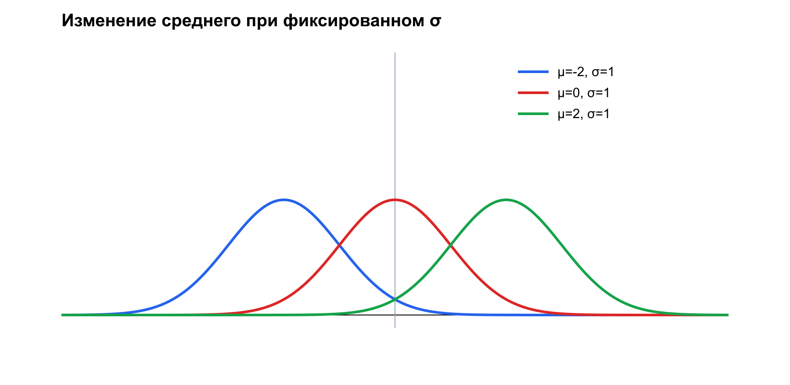

# Лекция № 8. Нормальное распределение и предельные теоремы

> Продолжительность: 90 минут  
> Заключительная лекция курса

## 1. Место лекции

Мы завершаем курс двумя связанными идеями. Нормальное распределение даёт важнейшую непрерывную модель, а предельные теоремы объясняют, почему средние и суммы во многих задачах ведут себя устойчиво и приближённо нормально.

Начнём с перехода лекции № 7. Для $X\sim N(10,2^2)$ границы 8 и 13 превращаются в $z_1=-1$ и $z_2=1{,}5$. Поэтому

$$
P(8< X<13)=\Phi(1{,}5)-\Phi(-1)
\approx0{,}9332-0{,}1587=0{,}7745.
$$

Это и есть основной маршрут нормальной задачи: перейти от $X$ к стандартной величине $Z$, найти площадь через $\Phi$ и вернуться к смыслу исходной величины.

### Результаты обучения

Студент должен уметь стандартизовать нормальную величину, вычислять интервальные вероятности, применять правило трёх сигм и неравенство Чебышёва, объяснять законы больших чисел и центральную предельную теорему и корректно использовать базовую статистическую терминологию.

### Входные знания

Функция распределения $F$, плотность $f$, математическое ожидание $M$, дисперсия $D$, стандартное отклонение $\sigma$, стандартизация и интегральная функция Лапласа. В этой лекции рабочее обозначение $\Phi$ означает полную стандартную нормальную функцию распределения $P(Z\le z)$; если в таблице дана функция Лапласа $L(z)=\Phi(z)-1/2$, сначала выполняется этот перевод.

### Ориентировочный тайминг

| Время | Содержание |
|---:|---|
| 0–7 мин | Ответ переходной задачи: вероятность 0,7745 |
| 7–24 мин | Нормальное распределение, параметры и графики семейства |
| 24–40 мин | Стандартизация, интервалы и правило 68–95–99,7 |
| 40–50 мин | ИДЗ 7.2 и задачи 6–7 КР № 3 |
| 50–61 мин | Неравенство и теорема Чебышёва |
| 61–73 мин | Теорема Бернулли, ошибка игрока и ЦПТ |
| 73–82 мин | Четыре режима вывода и готовая симуляция |
| 82–88 мин | Один пример проверки гипотез и маршрут СРС |
| 88–90 мин | Типичные ошибки и резюме курса |

## 2. Нормальное распределение

$X$ имеет нормальное распределение с параметрами $\mu$ и $\sigma>0$, если

$$
\boxed{f_X(x)=\frac1{\sigma\sqrt{2\pi}}
\exp\!\left[-\frac{(x-\mu)^2}{2\sigma^2}\right].}
$$

Обозначение:

$$
X\sim N(\mu,\sigma^2).
$$

Здесь

$$
M(X)=\mu, D(X)=\sigma^2.
$$

Кривая симметрична относительно $x=\mu$. Увеличение $\mu$ сдвигает её, не меняя формы. Увеличение $\sigma$ делает кривую шире и ниже, сохраняя единичную площадь. Точки перегиба находятся в $\mu\pm\sigma$.

Нормальная модель возникает, когда наблюдаемый результат складывается из множества небольших независимых воздействий: ошибок измерения, производственных отклонений, совокупного шума. Это содержательная мотивация, но нормальность конкретных данных всё равно необходимо проверять.

При фиксированном $\sigma$ изменение $\mu$ только сдвигает кривую:



При фиксированном $\mu$ увеличение $\sigma$ делает кривую шире и ниже:


## 3. Стандартное нормальное распределение

Если

$$
Z=\frac{X-\mu}{\sigma},
$$

то $Z\sim N(0,1)$. Его функция распределения

$$
\Phi(z)=P(Z\le z)
$$

используется для любой нормальной величины:

$$
\boxed{P(\alpha< X<\beta)=
\Phi\!\left(\frac{\beta-\mu}{\sigma}\right)
-\Phi\!\left(\frac{\alpha-\mu}{\sigma}\right).}
$$

Симметрия:

$$
\Phi(-z)=1-\Phi(z).
$$

Стандартизация не меняет положение наблюдения относительно распределения: она измеряет отклонение в единицах стандартного отклонения. Значение $z=2$ означает «на две сигмы выше среднего» независимо от исходной единицы измерения.

Перед вычислением полезно схематично отметить центр, границы и нужную область. Если интервал расположен справа от центра, обе стандартизованные границы должны быть положительными. Такая геометрическая проверка обнаруживает многие ошибки знака.

## 4. Вероятность заданного отклонения

Для $t>0$:

$$
P(|X-\mu|< t)=2\Phi\!\left(\frac{t}{\sigma}\right)-1.
$$

Приближённые доли нормального распределения:

- внутри $\mu\pm\sigma$ — $68{,}27\%$;
- внутри $\mu\pm2\sigma$ — $95{,}45\%$;
- внутри $\mu\pm3\sigma$ — $99{,}73\%$.

Отсюда **правило трёх сигм**: выход нормальной величины за $\mu\pm3\sigma$ имеет вероятность около $0{,}0027$. Это свойство нормального закона, а не универсальное правило для любых данных.

### Для углубления: асимметрия и эксцесс

Асимметрия характеризует направление несимметричного хвоста, а эксцесс — отличие тяжести хвостов и остроты вершины от нормального эталона. Для нормального распределения оба стандартизованных показателя равны нулю. Эти характеристики относятся к необязательному расширению и не используются в контрольных задачах этой лекции.


## 5. ИДЗ № 7, задача 2

Пусть $X\sim N(-3,0{,}5^2)$. Плотность:

$$
f(x)=\frac1{0{,}5\sqrt{2\pi}}
\exp\left[-\frac{(x+3)^2}{2\cdot0{,}5^2}\right].
$$

Для интервала $(-2{,}7;-1{,}8)$:

$$
z_1=\frac{-2{,}7+3}{0{,}5}=0{,}6,\qquad
z_2=\frac{-1{,}8+3}{0{,}5}=2{,}4.
$$

$$
P(-2{,}7< X<-1{,}8)=\Phi(2{,}4)-\Phi(0{,}6)
\approx0{,}9918-0{,}7257=0{,}2661.
$$

## 6. Контрольная работа № 3, задача 6

По плотности

$$
f(x)=\frac1{3\sqrt{2\pi}}e^{-(x+2)^2/18}
$$

видно, что $\mu=-2$, $\sigma=3$, $D(X)=9$.

### 6.1. Преобразования характеристик

$$
M(X-2M(X))=M(X)-2M(X)=2.
$$

$$
D(3M(X)-2X)=(-2)^2D(X)=36.
$$

Так как $M(X^2)=D(X)+M^2(X)=9+4=13$,

$$
M(3X^2-5)=3\cdot13-5=34.
$$

### 6.2. Вероятности

$$
P(X\le-1)=\Phi\left(\frac{-1+2}{3}\right)
=\Phi(1/3)\approx0{,}6306.
$$

$$
P(-3{,}5< X<-1)=
\Phi(1/3)-\Phi(-1/2)
\approx0{,}6306-0{,}3085=0{,}3220.
$$

## 7. Контрольная работа № 3, задача 7

Обхват пясти имеет $\mu=19$ см, $\sigma=0{,}5$ см. Пять баллов получают при $X\ge18{,}5$.

$$
z=\frac{18{,}5-19}{0{,}5}=-1.
$$

$$
P(X\ge18{,}5)=P(Z\ge-1)=\Phi(1)\approx0{,}8413.
$$

Около $84{,}1\%$ жеребцов данной модельной группы удовлетворяют условию.

## 8. Неравенство Чебышёва

Для любой величины с конечными $M(X)$ и $D(X)$:

$$
\boxed{P(|X-MX|\ge\varepsilon)
\le\frac{D(X)}{\varepsilon^2}.}
$$

Эквивалентно,

$$
P(|X-MX|<\varepsilon)
\ge1-\frac{D(X)}{\varepsilon^2}.
$$

Неравенство универсально, поэтому часто даёт грубую оценку. При $\varepsilon=3\sigma$ оно гарантирует

$$
P(|X-\mu|<3\sigma)\ge1-\frac19=\frac89\approx0{,}889,
$$

тогда как для нормального закона точная вероятность около $0{,}9973$.

**Сопоставимый числовой пример.** Пусть известно только $M(X)=20$ и $\sigma(X)=2$. Интервал $(14;26)$ имеет вид $|X-20|<6$, то есть $\varepsilon=3\sigma$. Без знания закона Чебышёв гарантирует лишь

$$
P(14< X<26)\ge1-\frac{2^2}{6^2}=\frac89\approx0{,}8889.
$$

Если дополнительно известно, что $X\sim N(20,2^2)$, точный расчёт даёт

$$
P(14< X<26)=\Phi(3)-\Phi(-3)\approx0{,}9973.
$$

Число $0{,}8889$ — универсальная нижняя **оценка**, а $0{,}9973$ — **точная вероятность** в конкретной нормальной модели.

Идея доказательства проста. На событии $|X-MX|\ge\varepsilon$ квадрат отклонения не меньше $\varepsilon^2$. Поэтому средний квадрат отклонения не меньше произведения $\varepsilon^2$ на вероятность этого события:

$$
D(X)\ge\varepsilon^2P(|X-MX|\ge\varepsilon).
$$

После деления получаем неравенство Чебышёва. Оно ничего не предполагает о форме распределения, кроме существования дисперсии.

## 9. Закон больших чисел Чебышёва

**Общая формулировка.** Пусть $X_1,X_2,\ldots$ независимы, их дисперсии существуют и равномерно ограничены: существует $C<\infty$ такое, что

$$
D(X_k)\le C\quad\text{для всех }k.
$$

Тогда среднее центрированных величин сходится к нулю по вероятности:

$$
\boxed{
\frac1n\sum_{k=1}^n\bigl(X_k-M(X_k)\bigr)
\xrightarrow{P}0.}
$$

Действительно, вследствие независимости

$$
D\!\left(\frac1n\sum_{k=1}^nX_k\right)
=\frac1{n^2}\sum_{k=1}^nD(X_k)
\le\frac{C}{n}\to0,
$$

а неравенство Чебышёва превращает исчезающую дисперсию в сходимость по вероятности.

**Одинаково распределённый случай — следствие.** Если независимые $X_1,\ldots,X_n$ имеют общее ожидание $\mu$ и дисперсию $\sigma^2<\infty$, то выборочное среднее

$$
\overline X_n=\frac{X_1+\cdots+X_n}{n}
$$

сходится по вероятности к $\mu$:

$$
\boxed{P(|\overline X_n-\mu|<\varepsilon)\to1.}
$$

Дисперсия среднего равна

$$
D(\overline X_n)=\frac{\sigma^2}{n},
$$

поэтому среднее становится устойчивее с ростом $n$.

Закон не утверждает, что отдельные наблюдения приближаются к ожиданию, и не гарантирует монотонного улучшения каждой следующей выборки.

Пример: среднее время ответа сервиса по тысяче независимых запросов обычно стабильнее времени одного запроса. Но увеличение выборки не исправляет систематическую ошибку сбора данных и не делает зависимые наблюдения независимыми.

## 10. Закон больших чисел Бернулли

Если в независимых испытаниях вероятность события равна $p$, а относительная частота

$$
W_n=\frac{m_n}{n},
$$

то для любого $\varepsilon>0$

$$
\boxed{P(|W_n-p|<\varepsilon)\to1.}
$$

Это частный случай устойчивости среднего для индикаторов события. Вероятность $p$ относится к модели до опыта, частота $W_n$ — к данным после серии опытов.

Оценка Чебышёва для индикаторов имеет вид

$$
P(|W_n-p|\ge\varepsilon)
\le\frac{p(1-p)}{n\varepsilon^2}.
$$

Правая часть убывает как $1/n$, что формально выражает стабилизацию частоты.

### Ошибка игрока

После длинной серии проигрышей игрок рассуждает: «частота должна вернуться к вероятности, значит следующий выигрыш стал вероятнее». Это неверно. В независимых испытаниях

$$
P(\text{выигрыш в следующем опыте}\mid\text{прошлая серия})=p.
$$

Теорема Бернулли описывает относительную частоту в длинной серии, но не требует краткосрочной «компенсации» и не предсказывает исход следующего опыта. Частота может приближаться к $p$ за счёт роста знаменателя, а не обязательного чередования результатов.

## 11. Центральная предельная теорема

Пусть $X_i$ независимы и одинаково распределены, имеют ожидание $\mu$ и конечную ненулевую дисперсию $\sigma^2$. Тогда стандартизованная сумма

$$
Z_n=\frac{X_1+\cdots+X_n-n\mu}{\sigma\sqrt n}
$$

по распределению стремится к $N(0,1)$.

Эквивалентно, при больших $n$

$$
\overline X_n\approx N\left(\mu,\frac{\sigma^2}{n}\right).
$$

ЗБЧ отвечает на вопрос, **куда** стремится среднее. ЦПТ описывает, **как распределены его случайные отклонения** после масштабирования.

Исходная величина не обязана быть нормальной. Но независимость, одинаковое распределение и конечная дисперсия — существенные условия данной формулировки.

Интуитивно сумма складывает множество малых случайных причин: отдельные особенности частично сглаживаются, а после вычитания центра и деления на масштаб остаётся универсальная колоколообразная форма. Это объяснение помогает понять теорему, но не заменяет её условия.

### Практическая интерпретация

ЦПТ объясняет нормальные доверительные приближения для средних, сумм и долей. Она не утверждает, что исходные данные стали нормальными: приближённо нормальным становится распределение правильно центрированной и масштабированной суммы.

Скорость приближения зависит от исходного распределения. При сильной асимметрии или тяжёлых хвостах может понадобиться больше наблюдений. Правило «$n=30$ всегда достаточно» не является теоремой.

## 12. Точное, оценочное, приближённое и предельное

| Режим вывода | Когда применим | Что получаем | Правильный язык |
|---|---|---|---|
| Точный нормальный расчёт | Закон $X\sim N(\mu,\sigma^2)$ задан или обоснован | $P(a< X< b)=\Phi(z_b)-\Phi(z_a)$ | «вероятность равна» |
| Оценка Чебышёва | Известны только конечные $M$ и $D$ | Универсальная верхняя или нижняя граница | «не больше / не меньше» |
| Приближение Лапласа | Биномиальная величина, $npq$ достаточно велико; при необходимости используется поправка на непрерывность | Число, близкое к биномиальной вероятности при конечном $n$ | «приближённо равно» |
| ЗБЧ / ЦПТ | Выполнены условия соответствующей теоремы и рассматривается рост $n$ | ЗБЧ: концентрация среднего; ЦПТ: предельная форма масштабированных отклонений | «стремится», «при больших $n$» |

Эти четыре режима нельзя обозначать одним знаком равенства. Перед вычислением нужно назвать не только формулу, но и статус результата.

> **Точка остановки, 2 минуты.** Классифицируйте четыре фразы: «вероятность равна $0{,}9973$», «вероятность не меньше $8/9$», «биномиальная вероятность примерно $0{,}997$», «распределение стремится к нормальному». Ответ: точный расчёт, оценка, приближение и предельное утверждение соответственно.

## 13. Готовая иллюстрация ЗБЧ и ЦПТ

Моделируем бернуллиевскую величину с $p=0{,}3$. Для средних теоретически

$$
M(\overline X_n)=0{,}3,\qquad
D(\overline X_n)=\frac{0{,}21}{n}.
$$

Гистограммы показывают, как средние сжимаются вокруг $p=0{,}3$ и приобретают более гладкую форму. Это иллюстрация ЗБЧ и ЦПТ, а не доказательство этих теорем.


### Приложение: воспроизводимая симуляция и генераторы трёх SVG

```python
from random import Random
from math import erf, sqrt, exp, pi

def normal_pdf(x, mu, sigma):
    return exp(-((x - mu) ** 2) / (2 * sigma**2)) / (sigma * sqrt(2 * pi))

def normal_family_svg(filename, curves, title):
    width, height = 900, 440
    left, top, plot_w, plot_h = 70, 60, 760, 300
    colors = ('#2563eb', '#dc2626', '#16a34a')
    parts = [f'\x3csvg xmlns="http://www.w3.org/2000/svg" width="{width}" height="{height}">',
             '\x3crect width="100%" height="100%" fill="white"/>',
             '\x3cstyle>text{font-family:Arial;font-size:15px}.title{font-size:20px;font-weight:bold}\x3c/style>',
             f'\x3ctext class="title" x="70" y="30">{title}\x3c/text>',
             f'\x3cline x1="{left}" y1="{top+plot_h}" x2="{left+plot_w}" y2="{top+plot_h}" stroke="black"/>',
             f'\x3cline x1="{left+plot_w/2}" y1="{top}" x2="{left+plot_w/2}" y2="{top+plot_h+15}" stroke="#94a3b8"/>']
    for index, (mu, sigma, label) in enumerate(curves):
        points = []
        for i in range(241):
            x = -6 + 12 * i / 240
            px = left + (x + 6) * plot_w / 12
            py = top + plot_h - normal_pdf(x, mu, sigma) * 330
            points.append(f'{px},{py}')
        color = colors[index]
        parts.append(f'\x3cpolyline points="{" ".join(points)}" fill="none" stroke="{color}" stroke-width="3"/>')
        parts.append(f'\x3cline x1="590" y1="{82+24*index}" x2="625" y2="{82+24*index}" stroke="{color}" stroke-width="3"/>')
        parts.append(f'\x3ctext x="635" y="{87+24*index}">{label}\x3c/text>')
    parts.append('\x3c/svg>')
    with open(filename, 'w', encoding='utf-8') as file:
        file.write('\n'.join(parts))

normal_family_svg(
    'lecture_8_normal_mean.svg',
    [(-2, 1, 'μ=-2, σ=1'), (0, 1, 'μ=0, σ=1'), (2, 1, 'μ=2, σ=1')],
    'Изменение среднего при фиксированном σ',
)
normal_family_svg(
    'lecture_8_normal_sigma.svg',
    [(0, 0.5, 'μ=0, σ=0,5'), (0, 1, 'μ=0, σ=1'), (0, 2, 'μ=0, σ=2')],
    'Изменение σ при фиксированном среднем',
)

rng = Random(20260808)
p = 0.3
series = 50_000

def normal_cdf(z):
    return 0.5 * (1 + erf(z / sqrt(2)))

def sample_means(n):
    return [sum(rng.random() < p for _ in range(n)) / n for _ in range(series)]

results = {}
for n in (1, 5, 30, 100):
    values = sample_means(n)
    mean = sum(values) / series
    variance = sum((x - mean) ** 2 for x in values) / series
    results[n] = values
    print(f"n={n:3d}: среднее={mean:.5f}, D={variance:.6f}, теория D={p*(1-p)/n:.6f}")

# Проверка ЦПТ для n=100: P(|Z| <= 1).
n = 100
sigma_mean = sqrt(p * (1 - p) / n)
inside = sum(abs((x - p) / sigma_mean) <= 1 for x in results[n]) / series
normal_inside = normal_cdf(1) - normal_cdf(-1)
print(f"P(|Z|<=1): опыт={inside:.5f}, N(0,1)={normal_inside:.5f}")

# SVG: распределения выборочных средних для n=5, 30 и 100.
W, H = 960, 480
parts = ['\x3csvg xmlns="http://www.w3.org/2000/svg" width="960" height="480">',
         '\x3crect width="100%" height="100%" fill="white"/>',
         '\x3cstyle>text{font-family:Arial;font-size:15px}.t{font-size:20px}\x3c/style>',
         '\x3ctext class="t" x="230" y="28">Распределение средних сжимается около p = 0,3\x3c/text>']
colors = {5: '#93c5fd', 30: '#60a5fa', 100: '#1d4ed8'}
for panel, n in enumerate((5, 30, 100)):
    left = 40 + panel * 310
    top, pw, ph = 70, 270, 320
    bins = [0] * 25
    for value in results[n]:
        index = min(24, int(value * 25))
        bins[index] += 1
    maximum = max(bins)
    for i, count in enumerate(bins):
        h = ph * count / maximum
        parts.append(f'\x3crect x="{left+i*pw/25}" y="{top+ph-h}" width="{pw/25-1}" height="{h}" fill="{colors[n]}"/>')
    parts.append(f'\x3cline x1="{left}" y1="{top+ph}" x2="{left+pw}" y2="{top+ph}" stroke="black"/>')
    parts.append(f'\x3ctext x="{left+105}" y="{top+ph+28}">n = {n}\x3c/text>')
parts.append('\x3c/svg>')
with open("lecture_8_lln_clt.svg", "w", encoding="utf-8") as file:
    file.write("\n".join(parts))
```


При росте $n$ центр остаётся около $0{,}3$, дисперсия уменьшается как $1/n$, а форма стандартизованного распределения приближается к нормальной.

## 14. Мост к статистическим гипотезам

Статистика начинает с данных и задаёт вопрос о неизвестной модели.

- $H_0$ — нулевая гипотеза, базовое проверяемое утверждение.
- $H_1$ — альтернативная гипотеза.
- Уровень значимости $\alpha$ — допустимая вероятность отклонить верную $H_0$ выбранной процедурой.
- Статистика критерия — число, вычисленное по выборке.
- `p-value` — вероятность при условии $H_0$ получить результат не менее экстремальный, чем наблюдавшийся.

**Один сквозной пример.** Монету бросили 100 раз и получили 65 орлов. Проверяется

$$
H_0:p=0{,}5
\qquad\text{против}\qquad
H_1:p\ne0{,}5.
$$

При $H_0$ число орлов $X\sim\operatorname{Bin}(100,0{,}5)$. Результаты не менее экстремальные по двустороннему отклонению — это $X\le35$ или $X\ge65$. Поэтому

$$
p\text{-value}=P_{H_0}(X\le35\ \text{или}\ X\ge65)\approx0{,}0035.
$$

Это вероятность столь же сильного или более сильного расхождения **при условии справедливости $H_0$**, а не вероятность того, что $H_0$ истинна. При заранее выбранном $\alpha=0{,}05$ результат даёт основания отвергнуть $H_0$.

`p-value` не является вероятностью истинности $H_0$. Если `p-value` мало относительно $\alpha$, данные считают плохо согласующимися с $H_0$ и её отвергают. Иначе говорят «нет оснований отвергнуть», а не «$H_0$ доказана».

Отвержение верной $H_0$ называют ошибкой первого рода; вероятность такой ошибки контролируется уровнем $\alpha$. Неотвержение ложной $H_0$ — ошибка второго рода. Уменьшение одного риска без изменения объёма данных часто увеличивает другой, поэтому выбор порога является содержательным решением.

Критерий согласия проверяет соответствие распределения заданному закону. Критерий независимости проверяет наличие статистической связи между признаками. Полные процедуры относятся к курсу математической статистики.

## 15. Интерактив: найдите ошибки

- В экспоненте записано $2\sigma$, а не $2\sigma^2$.
- Стандартизация выполнена как $(X+\mu)/\sigma$.
- Значение плотности принято за вероятность точки.
- Правило трёх сигм применено к любому распределению.
- Из ЗБЧ сделан вывод, что отдельные наблюдения сходятся к $\mu$.
- Для ЦПТ потребовали нормальность исходных данных.
- `p-value=0,03` истолковано как трёхпроцентная вероятность истинности $H_0$.

После каждой ошибки аудитория должна назвать нарушенное определение и исправить запись.

## 16. Типичные ошибки

- путают параметры $N(\mu,\sigma^2)$ и подставляют дисперсию вместо $\sigma$;
- меняют знак при стандартизации;
- смешивают полную функцию $\Phi$ и табличную функцию Лапласа $L$;
- принимают высоту нормальной плотности за вероятность;
- применяют правило трёх сигм к произвольному распределению;
- называют нижнюю границу Чебышёва точной вероятностью;
- записывают приближение Лапласа знаком точного равенства;
- считают, что ЗБЧ заставляет отдельные наблюдения сходиться к среднему;
- используют ЦПТ без проверки независимости и конечной дисперсии;
- ждут повышения вероятности выигрыша после серии проигрышей;
- трактуют `p-value` как вероятность истинности $H_0$;
- фразу «нет оснований отвергнуть» заменяют словом «доказано».

## 17. Алгоритм решения нормальной задачи

1. Выделить $\mu$ и $\sigma$.
2. Нарисовать интервал относительно центра.
3. Стандартизовать каждую границу.
4. Выбрать разность, хвост или симметричную формулу через $\Phi$.
5. Проверить знак и разумность результата.
6. Интерпретировать вероятность в исходных единицах.

## 18. Резюме курса

Мы прошли путь от пространства исходов и событий к вероятностям, условию и Байесу; от повторных испытаний — к распределениям; от распределений — к ожиданию, разбросу и зависимости; от непрерывных моделей — к нормальному закону и предельным теоремам. Общий навык курса — сначала построить вероятностную модель, затем выбрать формулу и только после вычисления интерпретировать ответ.

## 19. Самопроверка и итоговое задание

1. Как параметры влияют на нормальную кривую?
2. Как стандартизовать границы интервала?
3. В чём состоит правило трёх сигм?
4. Чем оценка Чебышёва отличается от точной вероятности?
5. Чем ЗБЧ отличается от ЦПТ?
6. Что означает `p-value` и чего он не означает?
7. Чем критерий согласия отличается от критерия независимости?

Итоговое задание: выбрать прикладную величину, определить эксперимент, закон распределения, параметры, вероятность содержательного события и способ эмпирической проверки модели.

## 20. Маршрут СРС: тема 5

Самостоятельная работа завершается коротким письменным листом из пяти пунктов:

1. Для $M(X)=20$, $\sigma=2$ получить оценку Чебышёва для $(14;26)$ и объяснить, почему это не точная вероятность.
2. Сформулировать общую теорему Чебышёва для независимых величин с равномерно ограниченными дисперсиями и отдельно её одинаково распределённое следствие.
3. Для независимых испытаний с $n=400$, $p=0{,}4$ по Чебышёву оценить вероятность $P(|W_n-p|<0{,}05)$. Проверяемый ответ: не меньше $0{,}76$.
4. В двух предложениях развести ЗБЧ и ЦПТ: что стабилизируется и что получает предельную форму.
5. Объяснить ошибку игрока и записать вероятность следующего успеха после любой прошлой серии при независимых испытаниях.

Вопросы для устной проверки: какие условия нужны общей теореме Чебышёва; почему нормальность исходных данных не требуется в данной формулировке ЦПТ; почему стабилизация частоты не означает краткосрочной компенсации.

## 21. Покрытие плана, РПД и компетенций

| Требование | Покрытие |
|---|---|
| Нормальный закон и параметры | 2–4 |
| Стандартизация и интервалы | 3–7, 17 |
| Правило трёх сигм | 4 |
| Чебышёв и ЗБЧ | 8–10 |
| ЦПТ | 11–13 |
| Статистический мост | 14 |
| Самостоятельная тема 5 | 9–12, 20 |
| ИДЗ № 7, задача 2 | 5 |
| КР № 3, задачи 6–7 | 6–7 |
| Вопросы 30–33 | 2–7 |
| ОПК-1.1–1.3 | выбор модели и математическая интерпретация |
| ОПК-6.1–6.3 | вычислительный эксперимент и проверка |
| MF-1.2 | распределения и статистические зависимости |
| MF-1.3 | вводная терминология гипотез и критериев |

## 22. Источники

### Быстрые ссылки для самостоятельного изучения

- [Гмурман: глава 9, §§ 2–6, PDF-с. 102–111](<../sources/Gmurman_V_E_Teoria_veroyatnostey_i_matematicheskaya_statistika.pdf#page=102>) — неравенство Чебышёва, теоремы Чебышёва и Бернулли.
- [Гмурман: глава 12, §§ 2–8, PDF-с. 128–138](<../sources/Gmurman_V_E_Teoria_veroyatnostey_i_matematicheskaya_statistika.pdf#page=128>) — нормальный закон, интервальные вероятности, три сигмы и ЦПТ.
- [Математика в машинном обучении: § 6.5, PDF-с. 254–263](<../sources/математика для машинного обучения.pdf#page=254>) — гауссово распределение и линейные преобразования.
- [Глубокое обучение: глава 2, § 2.1, PDF-с. 40–53](<../sources/Glubokoe_obuchenie_Pogruzhenie_v_mir_neyronnykh_setey.pdf#page=40>) — вероятностный и статистический контекст моделей.
- [РПД: нормальный закон и предельные теоремы, PDF-с. 11–14](<../sources/Б1.О.09.01 Теория вероятностей РПД СИИ ПРБ.pdf#page=11>) и [задачи / вопросы, PDF-с. 17–20](<../sources/Б1.О.09.01 Теория вероятностей РПД СИИ ПРБ.pdf#page=17>).

- Основной: В. Е. Гмурман, глава 9, §§2–6; глава 12, §§2–8.
- Обогащение: «Математика в машинном обучении», §6.5.
- Прикладной контекст: «Глубокое обучение. Погружение в мир нейронных сетей», §2.1.
- Нормативная сверка: РПД, семинары 16–17, самостоятельная тема 5, ИДЗ № 7, контрольная работа № 3, вопросы 30–33.
