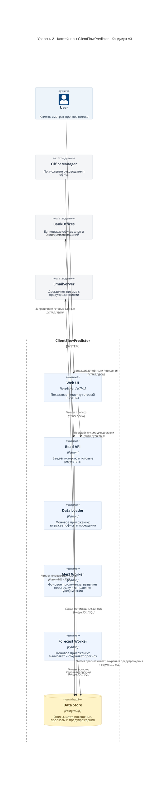

```mermaid
%% Native Mermaid C4. Technology choices remain an unapproved teaching proposal.
%%{init: {"c4": {"diagramMarginX": 40, "diagramMarginY": 40, "width": 260, "height": 110, "c4ShapeMargin": 80, "c4ShapePadding": 20}, "wrap": true}}%%
C4Container
  title Уровень 2 · Контейнеры ClientFlowPredictor · Кандидат v3
  Person(client, "User", "Клиент: смотрит прогноз потока")
  System_Ext(managerSystem, "OfficeManager", "Приложение руководителя офиса")
  System_Ext(offices, "BankOffices", "Банковские офисы: штат и история посещений")
  System_Ext(email, "EmailServer", "Доставляет письма с предупреждениями")
  System_Boundary(predictor, "ClientFlowPredictor") {
    Container(ui, "Web UI", "JavaScript / HTML", "Показывает клиенту готовый прогноз")
    Container(api, "Read API", "Python", "Выдаёт историю и готовые результаты")
    Container(loader, "Data Loader", "Python", "Фоновое приложение: загружает офисы и посещения")
    Container(alerts, "Alert Worker", "Python", "Фоновое приложение: выявляет перегрузку и отправляет уведомления")
    Container(forecast, "Forecast Worker", "Python", "Фоновое приложение: вычисляет и сохраняет прогноз")
    ContainerDb(db, "Data Store", "PostgreSQL", "Офисы, штат, посещения, прогнозы и предупреждения")
  }
  Rel(client, ui, "Смотрит прогноз")
  Rel(managerSystem, api, "Запрашивает готовые данные", "HTTPS / JSON")
  Rel(ui, api, "Читает прогноз", "HTTPS / JSON")
  Rel(api, db, "Читает готовые результаты", "PostgreSQL / SQL")
  Rel(loader, db, "Сохраняет исходные данные", "PostgreSQL / SQL")
  Rel(forecast, db, "Читает историю<br/>Сохраняет прогноз", "PostgreSQL / SQL")
  Rel(alerts, db, "Читает прогноз и штат; сохраняет предупреждения", "PostgreSQL / SQL")
  Rel(loader, offices, "Запрашивает офисы и посещения", "HTTPS / JSON")
  Rel(alerts, email, "Передаёт письма для доставки", "SMTP / STARTTLS")
  UpdateLayoutConfig($c4ShapeInRow="4", $c4BoundaryInRow="1")
  UpdateRelStyle(client, ui, $offsetX="-110", $offsetY="-55")
  UpdateRelStyle(managerSystem, api, $offsetX="-155", $offsetY="0")
  UpdateRelStyle(loader, offices, $offsetX="20", $offsetY="0")
  UpdateRelStyle(alerts, email, $offsetX="20", $offsetY="0")
  UpdateRelStyle(ui, api, $offsetX="-60", $offsetY="-35")
  UpdateRelStyle(api, db, $offsetX="-150", $offsetY="-25")
  UpdateRelStyle(loader, db, $offsetX="-45", $offsetY="-20")
  UpdateRelStyle(alerts, db, $offsetX="0", $offsetY="65")
  UpdateRelStyle(forecast, db, $offsetX="-60", $offsetY="-35")

%% Light fills keep labels fully opaque and readable.
  UpdateElementStyle(client, $bgColor="#edf4fa", $fontColor="#25364a", $borderColor="#9bb5ca")
  UpdateElementStyle(managerSystem, $bgColor="#f4f5f7", $fontColor="#374151", $borderColor="#c4cbd4")
  UpdateElementStyle(offices, $bgColor="#f4f5f7", $fontColor="#374151", $borderColor="#c4cbd4")
  UpdateElementStyle(email, $bgColor="#f4f5f7", $fontColor="#374151", $borderColor="#c4cbd4")
  UpdateElementStyle(ui, $bgColor="#eef5ff", $fontColor="#25364a", $borderColor="#a9bed8")
  UpdateElementStyle(api, $bgColor="#eef5ff", $fontColor="#25364a", $borderColor="#a9bed8")
  UpdateElementStyle(loader, $bgColor="#eef5ff", $fontColor="#25364a", $borderColor="#a9bed8")
  UpdateElementStyle(forecast, $bgColor="#eef5ff", $fontColor="#25364a", $borderColor="#a9bed8")
  UpdateElementStyle(alerts, $bgColor="#eef5ff", $fontColor="#25364a", $borderColor="#a9bed8")
  UpdateElementStyle(db, $bgColor="#fef3c7", $fontColor="#57451b", $borderColor="#c9a95d")

```