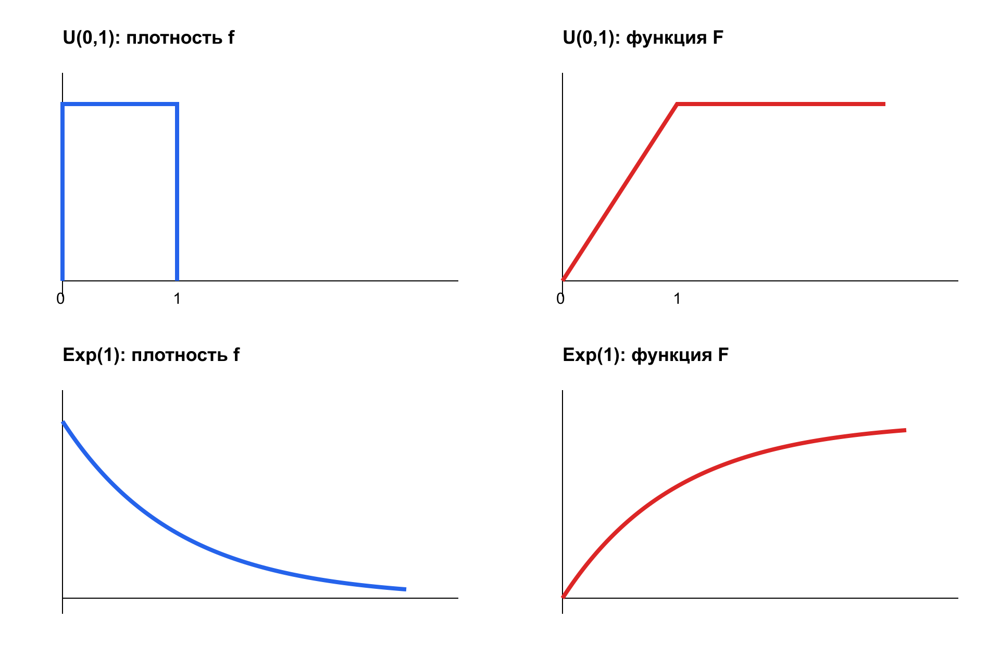

# Лекция № 7. Непрерывные случайные величины

В дискретной модели вероятность сосредоточена в отдельных значениях. Для времени, длины, массы и ошибок измерения естественнее непрерывная модель: вероятность задаётся площадью на интервале.

## 1. Плотность и функция распределения

Непрерывная случайная величина имеет функцию распределения

$$
F_X(x)=P(X\le x)=\int_{-\infty}^{x}f_X(t)\,dt,
$$

где $f_X$ — плотность. В точках непрерывности

$$
f_X(x)=F_X'(x).
$$

Плотность должна удовлетворять

$$
f_X(x)\ge0,
\qquad
\int_{-\infty}^{+\infty}f_X(x)\,dx=1.
$$

Значение плотности не является вероятностью и может быть больше 1. Вероятность задаётся интегралом.

## 2. Вероятность интервала

Для $a<b$

$$
P(a<X\le b)=F_X(b)-F_X(a)=\int_a^bf_X(x)\,dx.
$$

Для непрерывной величины

$$
P(X=x_0)=0.
$$

Поэтому строгие и нестрогие границы интервала дают одинаковую вероятность. Нулевая вероятность точки не означает логической невозможности значения: отдельная точка имеет нулевую площадь.

## 3. Пример с полиномиальной плотностью

Пусть

$$
f_X(x)=
\begin{cases}
3x^2,&0\le x\le1,\\
0,&\text{иначе}.
\end{cases}
$$

Нормировка выполняется:

$$
\int_0^13x^2\,dx=1.
$$

Функция распределения:

$$
F_X(x)=
\begin{cases}
0,&x<0,\\
x^3,&0\le x\le1,\\
1,&x>1.
\end{cases}
$$

Отсюда

$$
P(X>0{,}5)=1-F_X(0{,}5)=1-0{,}125=0{,}875.
$$

Если плотность содержит неизвестный коэффициент, сначала его находят из нормировки, затем строят $F$ и вычисляют вероятности.

## 4. Числовые характеристики

Для непрерывной величины суммы заменяются интегралами:

$$
E[X]=\int_{-\infty}^{+\infty}xf_X(x)\,dx,
$$

$$
E[X^2]=\int_{-\infty}^{+\infty}x^2f_X(x)\,dx,
$$

$$
D(X)=E[X^2]-(E[X])^2,
\qquad \sigma(X)=\sqrt{D(X)}.
$$

Формулы применимы, если интегралы существуют. Для плотности $3x^2$ на $[0,1]$

$$
E[X]=\int_0^13x^3\,dx=\frac34,
$$

$$
E[X^2]=\int_0^13x^4\,dx=\frac35,
$$

$$
D(X)=\frac35-\frac9{16}=\frac3{80},
\qquad \sigma(X)\approx0{,}194.
$$

## 5. Равномерное распределение

Если $X\sim U(a,b)$, то

$$
f_X(x)=
\begin{cases}
\dfrac1{b-a},&a\le x\le b,\\
0,&\text{иначе}.
\end{cases}
$$

Внутри интервала

$$
F_X(x)=\frac{x-a}{b-a}.
$$

Характеристики:

$$
E[X]=\frac{a+b}{2},
\qquad
D(X)=\frac{(b-a)^2}{12}.
$$

Модель подходит, когда интервалы равной длины имеют равные вероятности. Если время ожидания равномерно на $[0,20]$, среднее равно 10 минутам, а вероятность ждать не более 5 минут равна $5/20=0{,}25$.

## 6. Показательное распределение

Если $T\sim\operatorname{Exp}(\lambda)$, $\lambda>0$, то

$$
f_T(t)=
\begin{cases}
\lambda e^{-\lambda t},&t\ge0,\\
0,&t<0.
\end{cases}
$$

$$
F_T(t)=1-e^{-\lambda t},
\qquad P(T>t)=e^{-\lambda t},
$$

$$
E[T]=\frac1\lambda,
\qquad D(T)=\frac1{\lambda^2}.
$$

Ключевое свойство — отсутствие памяти:

$$
P(T>s+t\mid T>s)=P(T>t).
$$

При $\lambda=0{,}001$

$$
P(T>1500)=e^{-1{,}5}\approx0{,}2231.
$$

Показательная модель описывает постоянную интенсивность внезапных отказов. При старении интенсивность меняется, отсутствие памяти нарушается.

## 7. Дефект задачи КР 3.5

В РПД требуется восстановить плотность по графику, но сам график в PDF отсутствует. Поэтому официальную задачу нельзя решить численно без недостающих данных.

**Статус:** задача внешне заблокирована до получения исходного графика. Следующий пример — только учебный аналог и не является восстановлением условия.

Пусть

$$
f(x)=
\begin{cases}
cx,&0<x<2,\\
0,&\text{иначе}.
\end{cases}
$$

Нормировка даёт

$$
c\int_0^2x\,dx=2c=1,
\qquad c=\frac12.
$$

Тогда

$$
F(x)=
\begin{cases}
0,&x\le0,\\
x^2/4,&0<x<2,\\
1,&x\ge2,
\end{cases}
$$

$$
E[X]=\int_0^2x\cdot\frac{x}{2}\,dx=\frac43.
$$

Метод иллюстрирует нормировку, интегрирование и вычисление ожидания, но не подменяет официальный график.

## 8. Геометрический алгоритм

1. Найти область, где плотность положительна.
2. Проверить неотрицательность.
3. Нормировать общую площадь до 1.
4. Интегрировать слева для получения $F$.
5. Проверить непрерывность $F$, монотонность и пределы 0 и 1.
6. Вычислять вероятность как площадь нужного интервала.
7. Для характеристик проверить существование интегралов.

## 9. Типичные ошибки

- плотность принята за вероятность точки;
- коэффициент не найден из нормировки;
- интегрирование выполнено вне носителя;
- в $F(x)$ потеряна кусочная структура;
- строгие границы ошибочно дают разные ответы;
- показательный закон применён к стареющему объекту;
- для КР 3.5 придуманы отсутствующие данные.

## 10. Итоги

- Функция распределения равна интегралу плотности.
- Вероятность интервала — площадь под плотностью.
- Вероятность отдельной точки непрерывной величины равна нулю.
- Ожидание и дисперсия вычисляются интегрированием.
- Равномерный закон задаёт постоянную плотность на интервале.
- Показательный закон требует постоянной интенсивности и отсутствия памяти.

## Вопросы для самопроверки

1. Почему плотность может быть больше 1?
2. Почему границы интервала не влияют на непрерывную вероятность?
3. Как найти неизвестный коэффициент плотности?
4. Как интерпретировать параметр показательного закона?
5. Почему учебный аналог КР 3.5 нельзя считать официальным решением?
